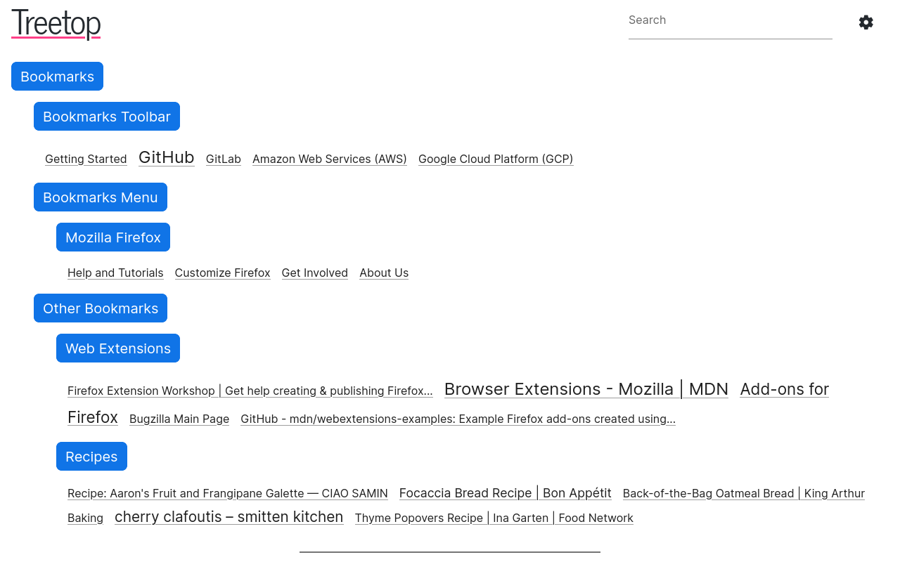

[](https://github.com/msmolens/treetop/actions?query=workflow%3ACI)

#  Treetop

Treetop is a Firefox extension that provides a high-level live view of your bookmarks:



## Usage

### Getting started

- Open Treetop by clicking its icon in the toolbar.

- Treetop shows all your bookmarks on a single page.

### Always up-to-date

- Treetop updates automatically as you browse.

- Recently visited bookmarks have a larger font.

### Find and edit your bookmarks

- Search for bookmarks by name or URL.

- Right-click to edit or delete bookmarks and folders.

### Customize

- Click the Preferences button to customize Treetop's display.

- Click on a folder to make it the root folder.

## Development

### Requirements

- [Node.js](https://nodejs.org/) 14.x or greater
- Firefox browser

### Prerequisites

Install dependencies:

```
npm install --global web-ext
npm install
```

### Commands

| Command                | Description |
| ---------------------- | ----------- |
| `npm run build:dev`    | Build for development. |
| `npm run build`        | Build for release. |
| `npm run lint`         | Check code for linting errors. |
| `npm run lint:fix`     | Fix linting errors. |
| `npm run prettier`     | Check code for formatting errors. |
| `npm run prettier:fix` | Fix formatting errors. |
| `npm run validate`     | Check for unused CSS, a11y issues, and TypeScript errors with [svelte-check](https://github.com/sveltejs/language-tools/tree/master/packages/svelte-check). |
| `npm test`             | Run tests. |
| `web-ext run`          | Start Firefox and load the extension temporarily. |
| `web-ext build`        | Package the extension. |

### Core Technologies

#### Development
- [Svelte](https://svelte.dev/): Component framework.
- [TypeScript](https://www.typescriptlang.org/): Typed JavaScript.
- [Rollup](https://rollupjs.org/): Module bundler.
- [Svelte Material UI](https://sveltematerialui.com/): Material UI components for Svelte.
- [ESLint](https://eslint.org/): Static analyzer.
- [Prettier](https://prettier.io/): Code formatter.
- [web-ext](https://github.com/mozilla/web-ext): Command line tool for web extensions.
- [webextension-polyfill](https://github.com/mozilla/webextension-polyfill): WebExtension `browser` API polyfill.

#### Testing
- [Jest](https://jestjs.io/): Testing framework.
- [DOM Testing Library](https://testing-library.com/): Framework to test Svelte components.
- [mockzilla-webextension](https://lusito.github.io/mockzilla-webextension/): Mocking toolkit for web extensions.

## History

Treetop is a modern remake of my [My Portal](https://github.com/msmolens/myportal)
XUL/XPCOM Firefox extension.
